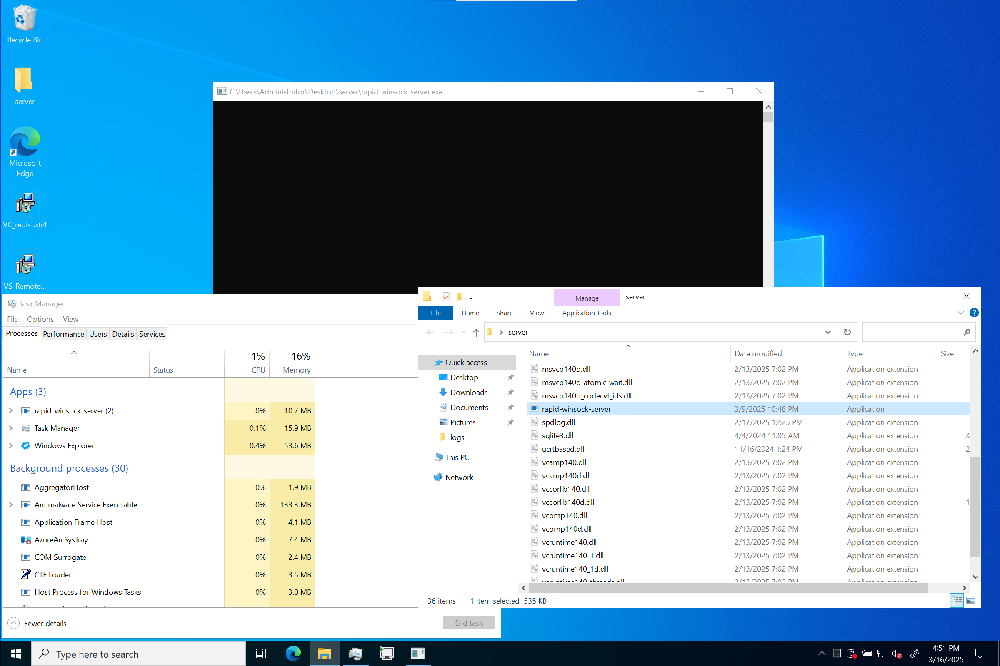
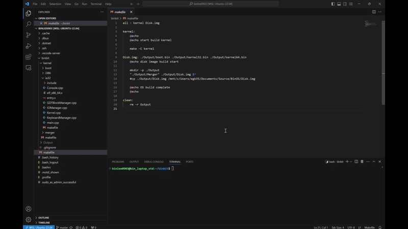
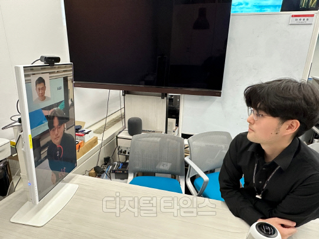

## About Me

Hi, I'm Gyeoungbin Lee!

- undergraduate student in the Dept. of Computer Science and Engineering @ Seoul National University of Science and Technology.

- Interests
    - 🌏 Network programming
    - 🌐 Web Programming
    - ⚡ Firmware programming
    - 👾 Computer Graphics

## Projects

- IOCP HTTPS Webserver(Working)
    - <a href="https://github.com/binlee0903/rapid-winsock-server" target="_blank"> code </a>
    - IOCP version is in another branch (IOCP branch)
    - https://binlee-blog.com (Running on this server)
    - This server is currently running on my home server.
    - 

- x86_64 64bit Operating System
    - <a href="https://github.com/binlee0903/binbit" target="_blank">code</a>
    - executed in qemu targeted x86_64 machine
    - 

- 안면마비 진단 솔루션
    - Code X
    - <a href="https://www.dt.co.kr/contents.html?article_no=2025010602101031076001&ref=naver" target="_blank">뉴스기사</a>
    - 안면마비 진단 시연
    - 
